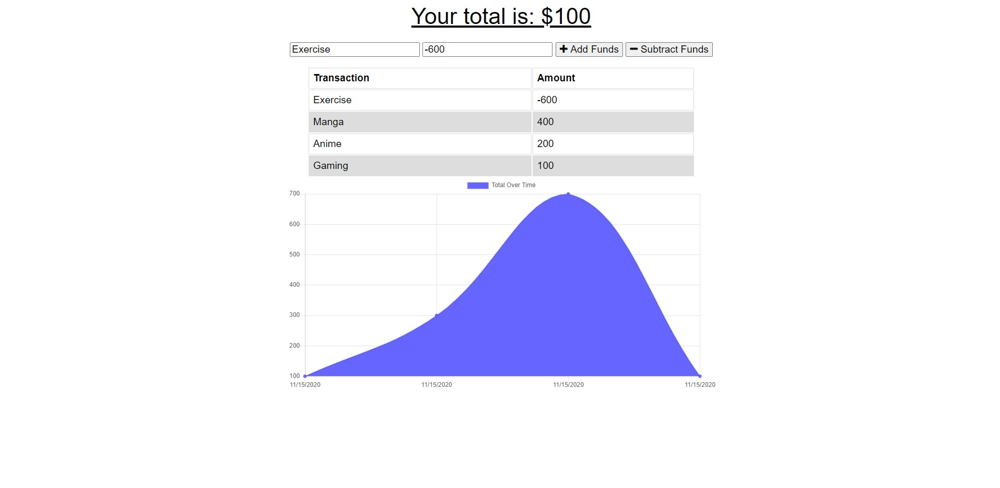

# Budget Tracker

## Description
This program is a budget tracking application. It has the ability to even function offline as a result of it being a PWA application.

## **Table of Contents**
* [ScreenShots](#Screenshots)
* [Usage](#Usage)
* [Credits](#Credits)
* [License](#License)

## Screenshots

## Usage
https://budget-d.herokuapp.com/

## Credits
Created by Jesus Molina

## License
This App is licensed under MIT

## Need Help?
Contact Me At:
Email: Jesusm1948@gmail.com
GitHub: https://github.com/Kos-MosV4
